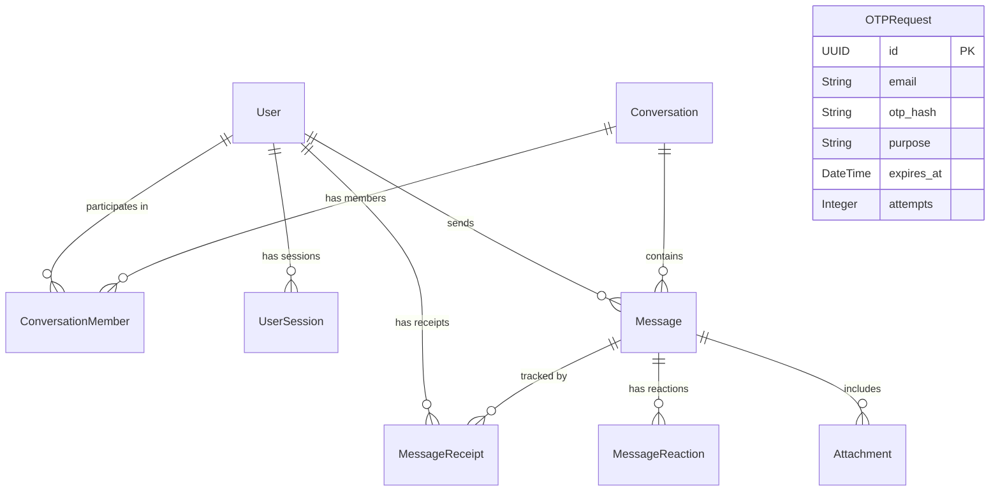

# Architecture & ER Diagram

## Architecture Overview

- **Backend:** 
  - `FastAPI` handles REST API endpoints (auth, conversations, media).
  - `python-socketio` handles real-time WebSocket communication.
  - Architecture relies on a `Services` layer (e.g., `IdentityService`, `ChatService`) decoupled from the API routers.
  - `DatabaseOTPStore` implements rate-limiting and hashed OTP storage to ensure secure onboarding.
  
- **Frontend:**
  - `Next.js` provides SSR and static delivery.
  - State management uses `Zustand` (session and UI state) and `TanStack Query` (server state & caching).
  - WebSockets interface via a singleton `socketService`.
  - UI strictly styled via `Tailwind CSS` and animated via `Framer Motion`.

## Entity Relationship (ER) Diagram

## Socket Flow

1. **Connection:** 
   Client calls `socket.connect(auth={ token })`. Server validates JWT in the connect handler.
2. **Real-time Sync:**
   - **Send Message:** Client calls REST API to persist message. Server emits `message.received` to all conversation members.
   - **Typing:** Client emits `typing.start`/`typing.stop` directly via socket. Server broadcasts to other members.
   - **Read Receipts:** Client emits `message.read`. Server updates DB and broadcasts `message.read` to sender.
