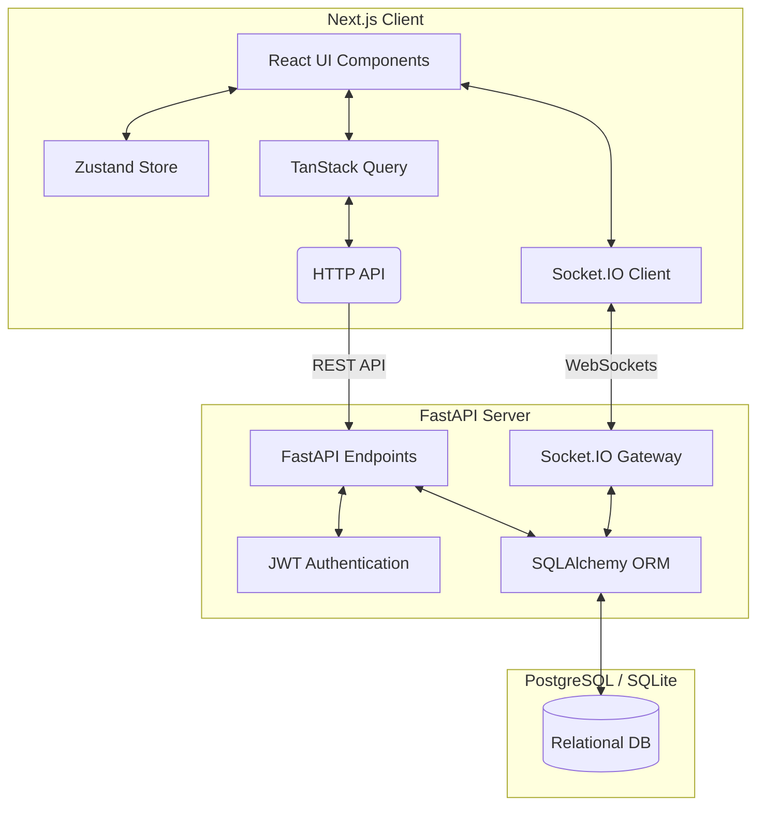
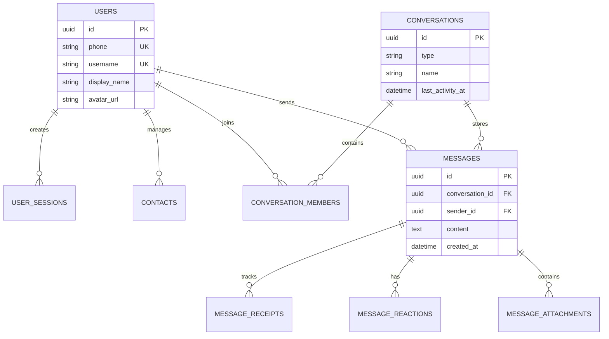

# Signal Clone (SDE Fullstack Assignment)

A fully functional clone of the Signal messaging application focusing on core messaging workflows, real-time synchronization, and a premium Signal Desktop-inspired user interface.

## 🚀 Features

### Core Messaging
- **Real-time Synchronization**: Powered by Socket.IO, messages appear instantly across clients.
- **Optimistic UI**: Messages render immediately in the UI before network confirmation.
- **Read & Delivery Receipts**: Track message status in real-time (✓✓).
- **Typing Indicators**: See when the other person is typing...
- **Direct & Group Conversations**: Chat 1-on-1 or create group chats.
- **Message Editing & Deletion**: Edit sent messages or delete them for everyone.

### Premium Experience
- **Pixel-perfect Design**: A desktop UI meticulously modelled after Signal Desktop and Telegram.
- **Responsive Layout**: Seamlessly adapts from wide desktop monitors to mobile viewports.
- **Dark Mode**: First-class dark mode support, defaulting to system preference.
- **Micro-animations**: Smooth Framer Motion transitions for toasts, modals, and list states.
- **Rich Media**: Supports image and video file attachments.

---

## 🏗 Architecture Diagram

---

## 🗄 Database Schema Diagram

---

## 📚 API Documentation
The API is built with FastAPI, which automatically generates OpenAPI interactive documentation.
Once deployed or running locally, visit:
- **Swagger UI**: `/docs`
- **ReDoc**: `/redoc`

**Key Endpoints**:
- `POST /api/v1/auth/register`: Mocked registration wizard endpoint.
- `GET /api/v1/conversations`: Retrieve active conversations.
- `POST /api/v1/conversations/{id}/messages`: Send a message.
- `POST /api/v1/media/upload`: Upload attachments.

---

## 🚀 Deployment Instructions

### Prerequisites
- Node.js 20+
- Python 3.12+

### Backend Setup (Render)
1. Fork or clone this repository to your Render-connected GitHub account.
2. In the Render Dashboard, create a new **Web Service**.
3. Choose the `backend` directory as the Root Directory.
4. Set the Build Command to `pip install -r requirements.txt`.
5. Set the Start Command to `uvicorn app.main:app --host 0.0.0.0 --port 10000`.
6. Add an Environment Variable: `DATABASE_BACKEND = postgresql`.
7. Link a Render PostgreSQL instance to the service.

### Frontend Setup (Vercel)
1. In the Vercel Dashboard, import your repository.
2. Set the Root Directory to `frontend`.
3. Framework Preset: Next.js.
4. Add the following Environment Variables:
   - `NEXT_PUBLIC_API_URL`: Your Render backend URL (e.g., `https://signal-clone-backend.onrender.com`)
   - `NEXT_PUBLIC_WS_URL`: Your Render backend URL.
5. Deploy!

---

## ⚠️ Known Limitations
- **Mocked Authentication**: As per assignment instructions, real SMS verification (Twilio) and end-to-end encryption protocols are intentionally omitted. A 6-digit mocked OTP (`123456`) is used.
- **Ephemeral Storage**: Media uploads are currently saved to the local filesystem. On ephemeral hosts like Render, these files will be lost upon restart. Production deployments should attach an AWS S3 bucket.
- **Voice/Video Calls**: Placeholder UI exists, but WebRTC signaling is not yet implemented.
- **Stories/Linked Devices**: Feature flagged as "Coming Soon" placeholders to match the product brief.
