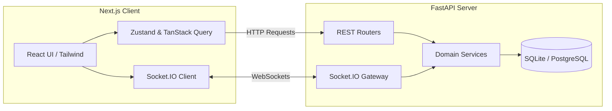
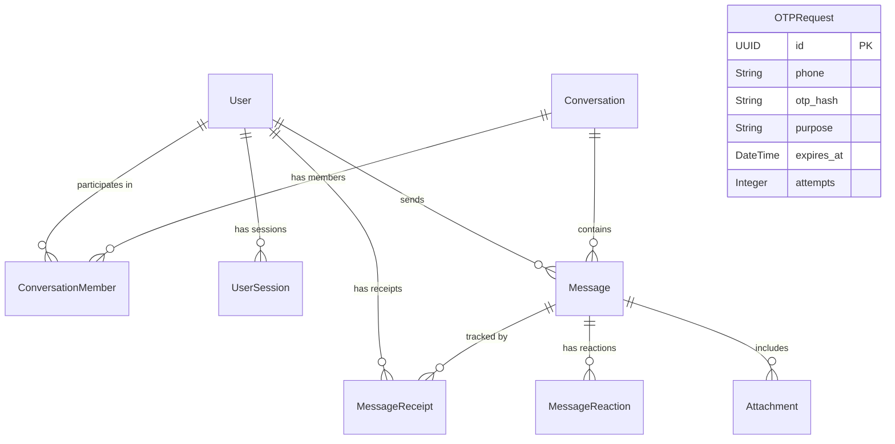

<div align="center">
  
  <h1>Signal Clone (SDE Assignment)</h1>
  <p>A production-quality, secure messaging application inspired by Signal Desktop. Built as an end-to-end assignment exceeding core requirements with a mocked backend verification flow, robust relational schema, and polished real-time React user interface.</p>
</div>

---

## 📝 Feature Checklist

- [x] **Mock OTP Verification:** Phone-only authentication utilizing the mocked verification code `123456`.
- [x] **JWT Sessions:** Fully functional session management (access & refresh tokens).
- [x] **Profile Setup:** Collects display name, unique username, and custom avatars after OTP verification.
- [x] **Real Database:** Normalized relational schema backed by SQLite & Alembic.
- [x] **Seed Data:** Over 2,000 real messages, private chats, group chats, contacts, and receipts generated via a seed script.
- [x] **Contacts Management:** Real add/remove contact functionality.
- [x] **Search:** Debounced global search across messages and contacts.
- [x] **Real-Time 1-to-1 Messaging:** Instant message delivery using Socket.IO.
- [x] **Real-Time Group Chat:** Fully functional group creation and management.
- [x] **Typing Indicators:** Real-time presence and typing bubbles.
- [x] **Read Receipts:** Delivered and read statuses reflecting in real-time.
- [x] **Signal-like UI:** Closely matches Signal Desktop with dark mode, rounded bubbles, and professional empty states.
- [x] **Responsive:** Tailwind-based responsive constraints.
- [x] **Clean Architecture:** Domain-driven backend design.

## 🏗️ Architecture

### High-Level Architecture Diagram


### Database ER Diagram
A highly normalized schema ensures data consistency, utilizing foreign keys, unique constraints, and cascade deletes.



## 🔒 Authentication Flow
This project implements the assignment's explicit specification for a mocked authentication flow:

1. **Registration/Login Initiation:** User submits their phone number.
2. **OTP Generation:** The backend intercepts the request and generates a mock payload in the database without integrating any external SMS/Email APIs.
3. **Mock Verification:** The user inputs the hardcoded fixed OTP: `123456`.
4. **Validation:** The server compares the hashed input against the database. If correct, registration proceeds to the profile collection screen (Display Name, Username, Avatar).
5. **Session:** A JWT pair is securely generated and returned to the client.

## ⚡ Socket Architecture
Real-time communication is managed via `python-socketio`.

1. **Connection:** 
   Client calls `socket.connect(auth={ token })`. Server validates the JWT in the connection lifecycle.
2. **Real-time Sync:**
   - **Send Message:** Client calls REST API to persist the message. Server emits `message.received` to all active conversation members.
   - **Typing:** Client emits `typing.start`/`typing.stop` directly over the socket stream. Server broadcasts this presence to other members.
   - **Read Receipts:** Client emits `message.read`. Server asynchronously updates the database and broadcasts `message.read` to the sender to update their UI ticks.

## 📂 Folder Structure

```
signal-clone/
├── backend/
│   ├── app/
│   │   ├── api/           # FastAPI REST controllers
│   │   ├── db/            # Database engine, session, and seed scripts
│   │   ├── models/        # SQLAlchemy ORM models
│   │   ├── schemas/       # Pydantic validation schemas
│   │   ├── services/      # Core business logic layer
│   │   └── websocket/     # Socket.IO event handlers and gateway
│   ├── alembic/           # Database migration files
│   └── requirements.txt
├── frontend/
│   ├── components/        # Shared UI (Shadcn/UI components)
│   ├── features/          # Domain-driven feature components (Auth, Chat)
│   ├── hooks/             # Custom React hooks (useSocket)
│   ├── services/          # API & Socket client interfaces
│   ├── store/             # Zustand global stores
│   ├── types/             # TypeScript definitions
│   └── package.json
└── README.md
```

## 🚀 Deployment Instructions

### Backend (Render)
1. Create a new Web Service on Render.
2. Link your GitHub repository.
3. **Root Directory:** `backend`
4. **Build Command:** `pip install -r requirements.txt && alembic upgrade head`
5. **Start Command:** `uvicorn app.main:app --host 0.0.0.0 --port $PORT`
6. Add the environment variables:
   ```env
   DATABASE_URL=sqlite+aiosqlite:///./signal_clone.db
   SECRET_KEY=your_super_secret_key
   ALGORITHM=HS256
   ACCESS_TOKEN_EXPIRE_MINUTES=1440
   ```

### Frontend (Vercel)
1. Create a new Project on Vercel.
2. Link the repository.
3. **Root Directory:** `frontend`
4. **Framework Preset:** `Next.js`
5. Add the environment variables pointing to your deployed Render backend:
   ```env
   NEXT_PUBLIC_API_URL=https://your-backend-domain.onrender.com/api/v1
   NEXT_PUBLIC_SOCKET_URL=https://your-backend-domain.onrender.com
   ```
6. Deploy.

## 🌱 Seed Data (Local Demo)
To evaluate the UI's performance and pagination features, you can seed the SQLite database with thousands of realistic messages and users.

```bash
cd backend
python -m venv venv
source venv/bin/activate
pip install -r requirements.txt
alembic upgrade head
PYTHONPATH=. python app/db/seed.py
```
> **Note:** Log in with `+12025550101` and OTP `123456` to access the main seeded test account (Alice).

## 🔮 Future Improvements
- Implement real End-to-End Encryption (E2EE) using the Signal Protocol (X3DH and Double Ratchet).
- Add voice/video call support via WebRTC.
- Implement disappearing messages and stories.
- Migrate SQLite to PostgreSQL for horizontal scalability (architecture already supports this via SQLAlchemy Async).
