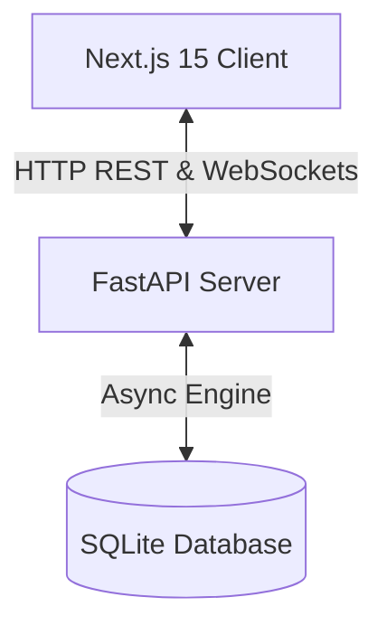

# System Architecture Design Document

This document outlines the architecture for the Signal Clone application.

## 1. High-Level Design

The Signal Clone is designed as a modular monorepo system containing a decoupled single-page frontend application and a service-oriented backend.



## 2. Backend Clean Architecture

The backend follows a strict layered pattern:

```
+-------------------------------------------------------------+
|                        API / Routes                         |
|   (FastAPI routes, schema validation via Pydantic v2)       |
+------------------------------+------------------------------+
                               |
                               v
+-------------------------------------------------------------+
|                       Service Layer                         |
|   (Business logic, domain rules, transaction boundaries)     |
+------------------------------+------------------------------+
                               |
                               v
+-------------------------------------------------------------+
|                      Repository Layer                       |
|   (Data access operations, raw SQL abstractions, SQLAlchemy) |
+-------------------------------------------------------------+
```

### Components:
- **API (Routes)**: Direct consumer of HTTP and WebSocket connections. Delegates logic immediately to Services.
- **Service Layer**: Decoupled from frameworks. Coordinates workflows, maps models to schemas, and performs auth validations.
- **Repository Layer**: The data interface. Eliminates raw db queries in service logic, promoting easy database switching and test mock capabilities.
- **WebSocket Manager**: Controls connection states, user sessions, event dispatch, and connection channels.

## 3. Frontend Architecture

The Next.js client is split into feature-based modules:

- **App Router (`app/`)**: Handles Next.js routing, metadata, page assemblies, and provider wrapper hierarchies.
- **Store (`store/`)**: lightweight Zustand stores representing transient UI actions.
- **Services (`services/`)**: client wrapper Singletons managing network connectivity (HTTP clients and Socket.IO client connections).
- **Features (`features/`)**: Modules encapsulating component interfaces, page fragments, and hooks related to specific features (e.g. `chat`, `auth`, `profile`).
