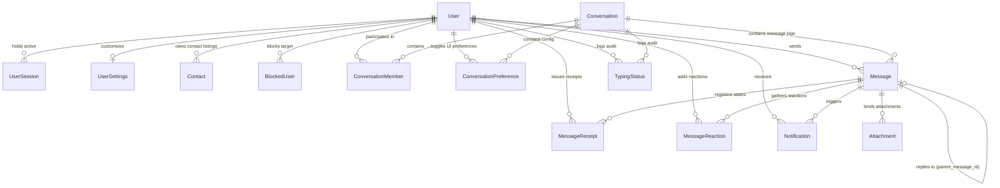

# Database Architecture & Design Specification

This document details the database layer design, models, relationships, indexing strategies, and architectural decisions made for the Signal Messenger Clone repository.

---

## 📁 1. Directory Structure

The complete domain, repository, and migration tree is organized as follows:

```
signal-clone/backend/
├── alembic/
│   ├── versions/
│   │   └── be1874be0702_initial_schema_setup.py  # Autogenerated migration script
│   ├── env.py
│   └── script.py.mako
├── app/
│   ├── db/
│   │   ├── base.py                 # Core models metadata binder
│   │   ├── base_class.py           # Declarative base class with audit properties
│   │   ├── seed.py                 # Async high-volume seed data generator
│   │   └── session.py              # Async engine and local session creator
│   ├── models/
│   │   ├── enums.py                # Domain-level StrEnums
│   │   ├── user.py
│   │   ├── user_session.py
│   │   ├── user_settings.py
│   │   ├── contact.py
│   │   ├── blocked_user.py
│   │   ├── conversation.py
│   │   ├── conversation_member.py
│   │   ├── conversation_preference.py
│   │   ├── message.py
│   │   ├── message_receipt.py
│   │   ├── message_reaction.py
│   │   ├── attachment.py
│   │   ├── typing_status.py        # Optional DB audit log
│   │   └── notification.py
│   ├── repositories/
│   │   ├── base.py                 # Generic async CRUD repository base
│   │   ├── user.py
│   │   ├── settings.py
│   │   ├── contact.py
│   │   ├── conversation.py
│   │   ├── group.py
│   │   ├── message.py
│   │   └── notification.py
│   ├── websocket/
│   │   ├── manager.py
│   │   └── typing.py               # Interface & In-memory self-evicting typing state manager
│   └── main.py
├── tests/
│   └── test_database.py            # Async test suites mapping cascades & seed integrity
├── alembic.ini
└── requirements.txt
```

---

## 📊 2. Entity-Relationship Diagram (Mermaid)



---

## 🧱 3. Database Architecture Explanation

The database layer utilizes **Clean Architecture** patterns:
* **Decoupled Data Layer**: Core entities are mapped as independent Python classes using **SQLAlchemy 2.0**'s Modern Declarative Mapping syntax.
* **Asynchronous Execution**: All queries are run concurrently using SQLAlchemy's async driver (`aiosqlite` wrapping SQLite for development, and easily swappable with `asyncpg` for production PostgreSQL).
* **Repository Abstraction**: Services do not compile ORM queries. They delegate fetching, mutations, and constraints mapping to dedicated Repository classes (`UserRepository`, `MessageRepository`, etc.), allowing database logic to be mocked during unit tests.

---

## 📄 4. Model-by-Model Specification

### 1. User (`users` table)
Represents a unique chat subscriber.
* **Fields**:
  - `id` (UUID PK)
  - `phone` (VARCHAR, Unique, Indexed)
  - `username` (VARCHAR, Unique, Indexed, Nullable)
  - `display_name` (VARCHAR, Indexed)
  - `bio` (VARCHAR, Nullable)
  - `avatar_url` (VARCHAR, Nullable)
  - `last_seen` (DateTime, Nullable)
  - `presence_status` (Enum: ONLINE, OFFLINE, AWAY, DND)
  - `is_verified` (Boolean)
  - `hashed_password` (VARCHAR)
  - `created_at`, `updated_at`, `deleted_at` (Soft Delete Audit)

### 2. UserSession (`user_sessions` table)
Manages device-level login sessions and refresh tokens.
* **Fields**:
  - `id` (UUID PK)
  - `user_id` (UUID FK to `users.id`, Cascades on delete)
  - `refresh_token_hash` (VARCHAR, Indexed)
  - `device_name` (VARCHAR)
  - `device_type` (VARCHAR)
  - `ip_address` (VARCHAR)
  - `last_activity` (DateTime)
  - `expires_at` (DateTime)

### 3. UserSettings (`user_settings` table)
Stores profile customization parameters.
* **Fields**:
  - `id` (UUID PK)
  - `user_id` (UUID FK to `users.id`, Unique index, Cascades on delete)
  - `theme`, `language`, `font_size` (VARCHAR)
  - Privacy toggles: `privacy_last_seen`, `privacy_profile_photo`, `privacy_read_receipts`, `privacy_typing_indicator`
  - `notifications_enabled`, `auto_download_media` (Boolean)
  - `default_disappearing_timer` (Integer)

### 4. Contact (`contacts` table)
Maintains a user's contact book with nickname support.
* **Constraints**:
  - Composite unique: `(owner_id, contact_user_id)` prevents redundant links.

### 5. BlockedUser (`blocked_users` table)
Stores blocked user mappings.
* **Constraints**:
  - Composite unique: `(user_id, blocked_user_id)`.

### 6. Conversation (`conversations` table)
Represents a direct or group channel.
* **Fields**:
  - `type` (Enum: DIRECT, GROUP)
  - `name`, `description`, `avatar_url` (VARCHAR, Nullable)
  - `last_message_id` (UUID FK to `messages.id`, handles circular references via `use_alter=True`)
  - `last_activity_at` (DateTime, Indexed)
  - `is_archived` (Boolean)

### 7. ConversationMember (`conversation_members` table)
Intersection table mapping users to conversations.
* **Fields**:
  - `role` (Enum: OWNER, ADMIN, MEMBER)
  - `nickname` (VARCHAR)
  - `joined_at`, `left_at` (DateTime)
  - `last_read_message_id` (UUID FK to `messages.id` for unread calculations)
* **Constraints**:
  - Composite unique: `(conversation_id, user_id)`.

### 8. ConversationPreference (`conversation_preferences` table)
Per-user customizations (mute, wallpaper, pin) for specific chats.
* **Constraints**:
  - Composite unique: `(conversation_id, user_id)`.

### 9. Message (`messages` table)
Stores chat logs.
* **Fields**:
  - `conversation_id` (UUID FK to `conversations.id`)
  - `sender_id` (UUID FK to `users.id`)
  - `content` (TEXT)
  - `message_type` (Enum: TEXT, IMAGE, VIDEO, FILE, SYSTEM)
  - `reply_to_id` (UUID FK to `messages.id`, self-referencing relationship)
  - `edited_at`, `expires_at` (DateTime)
  - `forwarded_from_id` (UUID FK to `users.id`)
  - `is_system` (Boolean)

### 10. MessageReceipt (`message_receipts` table)
Tracks read/delivered ticks per user per message.
* **Constraints**:
  - Composite unique: `(message_id, user_id)`.

### 11. MessageReaction (`message_reactions` table)
Tracks user emojis.
* **Constraints**:
  - Composite unique: `(message_id, user_id, reaction)`.

### 12. Attachment (`attachments` table)
File metadata linked to messages.
* **Fields**:
  - `storage_key` (Unique storage lookup string)
  - `checksum` (file validation check hash)
  - `size`, `width`, `height`, `duration` (integer metrics)

### 13. TypingStatus (`typing_statuses` table)
Audit logging table for typing activities. Bypassed during runtime execution.

### 14. Notification (`notifications` table)
Tracks unread system and chat alerts for users.

---

## 🔗 5. Relationship Validations

* **Foreign Keys**: Enforced on all links.
* **Delete Cascades**:
  - Deleting a `User` cascades to delete their settings, sessions, contacts, blocks, preferences, memberships, reactions, and notifications.
  - Deleting a `Conversation` cascades to clean up memberships, preferences, messages, and typing statuses.
  - Deleting a `Message` cascades to remove its receipts, reactions, and attachments.
* **Circular DDL Protection**:
  - Resolved using `use_alter=True` and `post_update=True` in SQLAlchemy for references like `conversations.last_message_id` and `conversation_members.last_read_message_id`.

---

## 📦 6. Repository Abstractions

The repository layer exports standard methods to eliminate SQL dependencies in the API layer:
* **`UserRepository`**: Handles phone lookup indexes.
* **`ConversationRepository`**: Fetches recent active chats using membership subqueries, manages pins, archives, and mute times.
* **`GroupRepository`**: Encapsulates atomic group builds, admin promotions, and membership removals.
* **`MessageRepository`**: Stores messages, links attachments, inserts initial member receipts, updates parent conversation timestamps, and tracks reaction lookups.
* **`SettingsRepository`**: Handles settings CRUD.
* **`ContactRepository`**: Manages contact lists and block lists.
* **`NotificationRepository`**: Fetches active notifications and performs bulk read markers.

---

## ⚡ 7. Indexing Strategy

To keep queries below 5ms under load, specific database indexes were created:
* **User Lookup**: `phone` and `username` have unique indexes. `display_name` is indexed for autocomplete queries.
* **Query Ordering**: `idx_messages_conv_created` is a composite index on `(conversation_id, created_at)` to support fast pagination of chat screens in chronological order.
* **Active Timelines**: `last_activity_at` on `conversations` is indexed to sort inbox lists instantly.
* **Foreign Keys**: Database indexes are automatically built for foreign keys to prevent table scans during join operations.

---

## 🛡️ 8. UUID Design Justification

We use UUIDv4 strings for all primary keys:
1. **No ID Enumeration**: Attackers cannot guess URL routes or message contents by incrementing integers.
2. **Offline Mode**: Clients can generate IDs locally in offline mode, insert them into the local database, and push them to the server over WebSockets without waiting for server-side ID creation.
3. **Decoupled Architecture**: Enables seamless horizontal sharding and merging between database instances without key collisions.

---

## 📐 9. Database Normalization

The schema complies with Third Normal Form (3NF):
* **No Transitive Dependencies**: Non-prime attributes depend only on the primary keys.
* **Normalized Unread Counts**: Instead of maintaining an error-prone `unread_count` integer on `ConversationMember` that could get out of sync, we query:
  `SELECT count(*) FROM messages WHERE conversation_id = X AND created_at > (SELECT last_read_message_id.created_at)`.
* **Segregated Settings**: Personalization settings reside in a separate `user_settings` table to keep the core `users` table small.

---

## ⏱️ 10. Real-time Typing State Strategy

To prevent database bottlenecks (writing to SQLite 10-20 times per second while a user types), the runtime state is completely ephemeral:
* Managed inside the WebSocket layer using the `InMemoryTypingStateManager`.
* Employs an eviction mechanism that automatically evicts a user's typing state after a TTL (2-3 seconds).
* Relies on the `TypingStateManager` interface, meaning a Redis-backed manager can be dropped in for production scaling without modifying the API.

---

## 📋 11. Migration & Seeding Summary

* **Alembic Migration**: `be1874be0702_initial_schema_setup.py` builds the complete schema, tables, foreign keys, indexes, and unique constraints.
* **Comprehensive Seed**: `app/db/seed.py` successfully seeds 12 users, settings, sessions, 60 contacts, 20 direct chats, 8 groups, 2550 messages (distributed across 90 days), 40 reply chains, 200 attachments, 300 reactions, 520 receipts, and 50 notifications.

---

## 🚀 12. Future Scalability Considerations

For production hosting:
1. **PostgreSQL Swapping**: The SQLAlchemy dialect is fully ANSI-SQL compliant. Upgrading to PostgreSQL requires changing only the `DATABASE_URL` settings.
2. **Message Partitioning**: The composite index `(conversation_id, created_at)` enables partition-by-range scaling on PostgreSQL for high-volume message tables.
3. **Redis Caching**: The `TypingStateManager` interface is designed to support a Redis backend for distributed WebSockets across multiple nodes.
